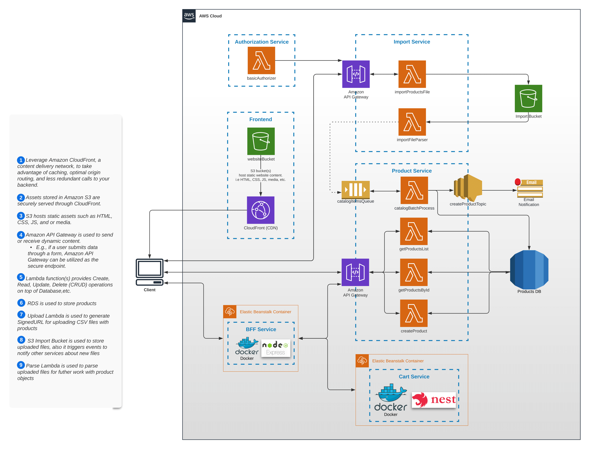

## Welcome to CDK TypeScript project

 

## **Goals**: Learning core AWS cloud services

## Tools and libraries used:

- AWS CLI
- AWS CDK ( JS )
- AWS SDK ( NodeJs )
- EB CLI for Elastic Beanstalk

---

<strong>Preview project architecture</strong>

### [Link to Cloud Front](https://d2w6eb7for7x7b.cloudfront.net)

---

### Notes:

> :warning: For some operations ( such as create/delete, import ... ) user authorization is required.  
> &nbsp; On this step this feature (authorization) is't realized in frontend-app (yet at least ). So, to full functionality, should set in browser local storage "manually" key
> `authorization_token -> U0FLNzQ6VEVTVF9QQVNTV09SRA==`
> ( base-64 encoded pair SAK:TEST_PASSWORD )

> :warning: Products list data is cached on proxy bff-service for 2 min.

> :warning: Access to RDS ( _cart_ & _order_ endpoints ) may be temporarily switch off to avoid additional charging.
